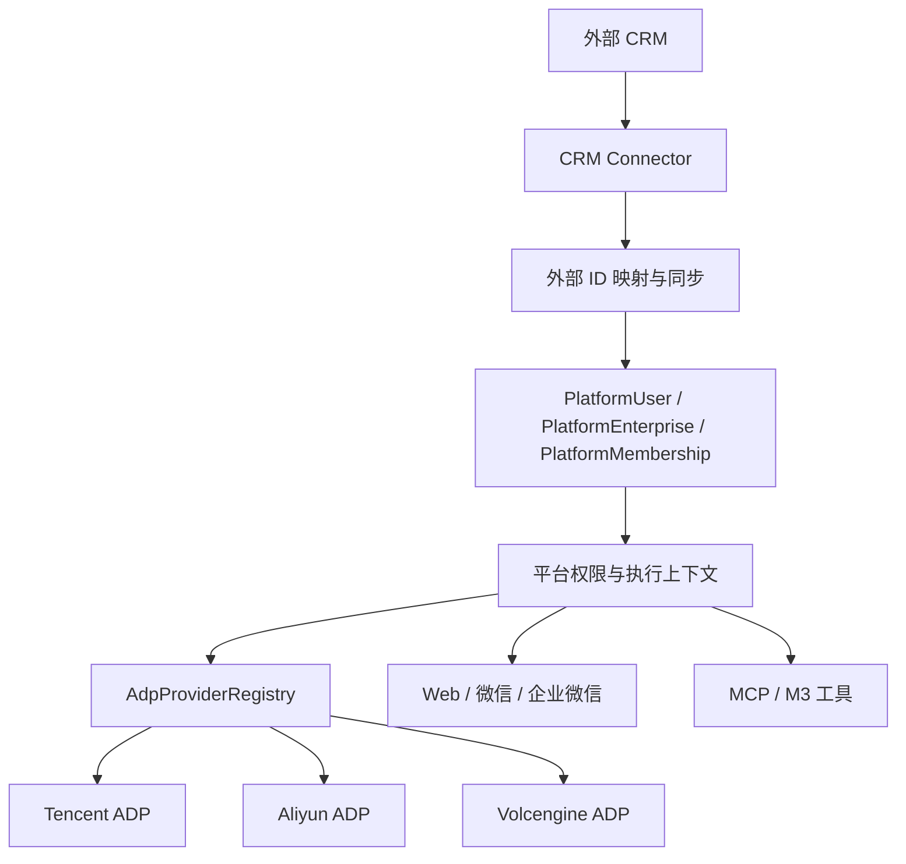

# 外部 CRM 与多云 ADP 扩展设计

## 目标与边界

平台继续拥有运行时身份、企业成员关系、权限和执行上下文。外部 CRM 是组织、联系人和外部身份的来源，腾讯云、阿里云和火山引擎 ADP 是 Agent 执行 Provider。两类外部系统都通过适配器接入，不能直接成为平台授权代码的依赖。



## CRM 扩展

平台内部使用稳定的 canonical ID。连接器将外部 `tenant + object_type + external_id` 映射到平台对象，外部 ID 不能直接作为平台权限判断。

连接器最小接口包括：配置校验、健康检查、组织分页、用户分页、身份解析和增量变更拉取。首次接入使用全量同步，之后保存游标做增量同步；支持 Webhook 的 CRM 再增加事件入口。同步失败时保留上次有效游标和映射，不自动扩大权限；新身份绑定必须在 CRM 可用时 fail closed。

建议的连接关系如下：

```text
platform_crm_connection
  provider_type / tenant_id / encrypted credentials / settings
  status / sync_cursor / last_sync_at

platform_external_identity_link
  connection_id / object_type / external_id
  platform_enterprise_id / platform_user_id / status

platform_external_membership_link
  connection_id / external_enterprise_id / external_user_id
  platform_membership_id / status
```

CRM 可以提供企业名称、联系人状态等事实，但不能静默提升平台角色和工具权限。平台成员关系失效时，撤销或收窄 `PlatformMembership`；CRM 暂时不可用时，已有授权只能在明确 TTL 内继续执行。

## 多云 ADP 扩展

`PlatformAdpApp` 保留现有 `Vendor`、`ServiceVendor` 和加密 `Ciphertext` 作为兼容字段，同时增加 Provider 语义：

```text
ProviderType          tencent_adp / aliyun_adp / volcengine_adp
ProviderSchemaVersion 厂商配置 schema 版本
ProviderSettings      非敏感厂商设置 JSON
Ciphertext            加密 credentials JSON
```

通用字段由平台处理，厂商字段由 Provider 自己验证和解释。不要继续把 `AliAccessKey`、`VolcSecretKey` 等厂商字段添加到平台主表。

```python
class AgentProvider(Protocol):
    @property
    def capabilities(self) -> frozenset[str]: ...

    async def execute(self, request: AgentRequest, *, sink: Any = None) -> AgentResponse: ...

    async def health_check(self) -> ProviderHealth: ...
```

Registry 只做 `provider_type -> factory` 解析。Provider 负责签名、URL、SSE、工具调用事件、错误码和厂商 metadata 转换；平台核心只处理 canonical `AgentRequest`/`AgentResponse`、企业授权、证据校验和审计。

应用选择顺序保持不变：企业绑定的应用 → 平台默认应用 → fail closed。ADP Provider 选择和 CRM 连接选择是两个独立维度，企业使用阿里云 ADP 不意味着必须使用阿里云 CRM。

## 安全和故障边界

- `corp_id`、`corp_user_id` 和外部 CRM ID 只用于映射和一致性校验，不能单独授权。
- `platform_context_token` 仍由平台签发并绑定用户、企业、权限版本、应用、渠道和会话。
- CRM 删除或停用事件不得直接进入模型上下文；先更新平台映射和权限版本。
- Provider 凭据只能存加密字段；普通列表、日志、审计均不得记录明文。
- Provider 能力不足时明确拒绝或降级，例如不支持工具调用的 Provider 不得执行 MCP 编排。
- 上游超时、限流、认证失败和结构化响应错误统一转换为平台错误，不把厂商错误原文透传给用户。

## 分阶段迁移

1. 第一阶段只增加模型、注册接口和兼容字段，现有腾讯 Provider 行为保持不变。
2. 第二阶段将腾讯配置校验移入腾讯 Provider，并增加管理端按 Provider 动态渲染配置表单。
3. 第三阶段接入一个只读 CRM Connector，完成全量同步、身份映射和健康检查。
4. 第四阶段接入第二个 ADP Provider，先完成配置校验和健康检查，再开放对话与工具调用能力。
5. 获得真实厂商租户、文档和凭据后，分别建立真实联调 TODO；本地 Mock 和契约测试不能替代第三方验收。

本阶段实现对应 `M1-EXT-ARCH-01`，不宣称已经接通任何外部 CRM、阿里云 ADP 或火山引擎 ADP。
