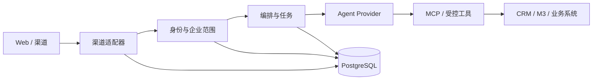

# 平台架构概览

项目定位为企业 AI 业务接入平台：平台负责身份、企业范围、权限、会话、任务和审计；Agent Provider 负责对话编排；业务系统适配器负责提供可校验的业务事实。

## 模块边界

| 模块 | 职责 |
| --- | --- |
| `backend/core` | 身份、企业、权限、会话、执行上下文、投递和审计 |
| `backend/router` | HTTP、管理、Portal、健康检查和 MCP 入口 |
| `backend/integrations/channels` | 入站验签、消息标准化、出站能力和重放保护 |
| `backend/integrations/adp` | Agent Provider 协议、注册表、能力探测和错误转换 |
| `backend/integrations/m3` | M3 认证、字段映射、企业过滤和结构化证据 |
| `backend/integrations/crm` | 外部 CRM 连接器协议和注册表 |
| `backend/model` | 平台数据模型和版本化迁移使用的表结构 |
| `frontend/packages/app` | 登录、Portal、管理后台和共享结果页面 |
| `backend/worker.py` | 持久化任务领取、执行、重试和回复 |

## 一次查询的生命周期

1. 渠道适配器验证来源并生成标准化入站消息。
2. 服务端根据绑定的渠道身份加载平台用户、有效成员关系、角色和企业范围。
3. 平台签发短期 `platform_context_token`，绑定用户、企业、权限版本、会话和执行回合。
4. Worker 选择启用的 Agent Provider，调用受控工具或 MCP。
5. 工具网关再次校验 API Key、执行上下文、权限和企业范围，再访问业务系统。
6. 返回结果经过字段过滤和证据化处理；渠道发送失败时保留可重试或未知状态，不重复发送不确定的私有结果。

## 权限原则

企业 ID、用户 ID、应用 ID 和渠道字段都是输入线索，不能单独授予权限。授权判断必须同时检查身份有效性、企业状态、成员关系、角色、工具权限、字段范围、会话状态和上下文有效期。账号停用、解绑、密码重置或范围收窄时，旧执行上下文和待发送私有结果必须失效。

## Provider 与 Connector

平台核心只依赖稳定的 `AgentRequest`、`AgentResponse`、工具调用和健康检查契约。厂商签名、SSE、错误码和元信息由 Provider 实现；CRM 通过外部租户和对象 ID 映射到平台的 canonical ID。接入新厂商时先完成配置校验和健康检查，再开放对话和工具能力。

更具体的 MCP、ADP 和工具请求示例见 [MCP 与 ADP 接入](../integrations/mcp-and-adp.md)，外部 CRM 和多云 Provider 的扩展原则见 [扩展设计](extensibility.md)。
